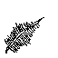

# pfederc

Documentation at [https://codefionn.github.io/pfederc]. Language documentation
at [https://codefionn.github.io/federlang].

## Build

Clone & build:

```bash
git clone https://github.com/codefionn/pfederc
cd pfederc
mkdir build ; cd build
cmake .. ; cmake --build .
```

Testing (in pfederc main directory):

```bash
cd build/test
ctest
```

Docker:

```bash
docker build -t pfederc .
```

## Documentation

Online at [https://codefionn.github.io/pfederc]. Build and open with:

```bash
doxygen .doxyconf
xdg-open docs/index.html
```
